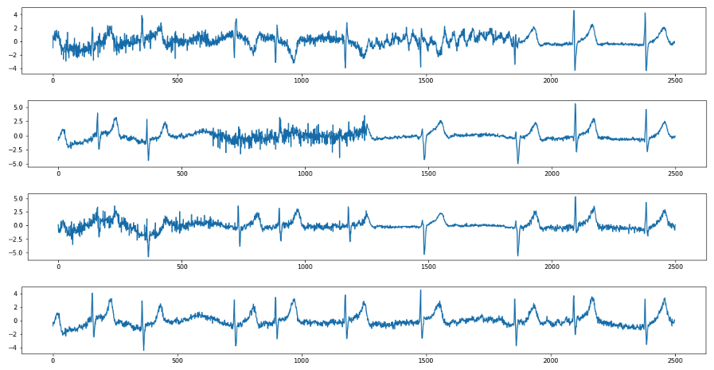
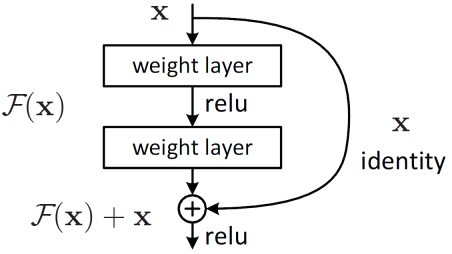

Aug 2021 - June 2022
# Automated ECG Diagnosis with ResNet

Heart conditions affect 500 million people yearly, and a 12-Lead Electrocardiogram (ECG) is one of the best ways to diagnose them effectively. However, interpreting an ECG usually requires a specialist, who are too busy to monitor patients constantly. This ResNet Model can automatically diagnose conditions from ECGs with human-level accuracy, so that busy doctors can be alerted when patients require attention.

This model has been trained on 4 important conditions: Atrial Fibrillation (AFib), Atrial Flutter (AFl), Supraventricular Tachycardia (SVT), and Myocardial Infarction (MI). Their Sensitivity (Sn), or true-positive, and Specificity (Sp), or true-negative, rates on out-of-sample test sets are below:
```
AFib -  Sn: 95.0%, Sp: 84.7%
AFl  -  Sn: 90.8%, Sp: 98.3%
SVT  -  Sn: XX%, Sp: XX%
MI:  -  Sn: XX%, Sp: XX%
```
Refer to this README for a quick summary of the implementation, or view the notebooks for an in-depth description.

## Data & Preprocessing

A total of 121,149 12-Lead ECG tracings from different countries were obtained from the following open-source databases:
```
1. CPSC Database: 13,256
2. INCART Database: 74
3. PTB and PTB-XL Database: 22,353
4. Georgia ECG Database: 20,672
5. Chapman-Shaoxing and Ningbo Database: 45,152
6. UMich Database: 19,642
```
The data can be downloaded from https://physionetchallenges.org/2021/. A sample of a 12-Lead ECG as displayed on a conventional hospital ECG paper would look something like this:



The preprocessing steps included reading the ECG metadata from the associated .mat files, before filtering out tracings which had unsuitable lenghts or data formats. As the actual ECG data files were large, only the filepaths and metadata was used to preprocess the data. A DataFrame of the final dataset was constructed that included the filepath and the labels for the 4 conditions mentioned, and then saved into the CSV file "full_dataset.csv".

## ResNet Model Overview

A ResNet employs skip-connections to mitigate the problem of vanishing gradients and allow for larger and larger models to train well. A simple illustration of a skip-connection is shown below:



As the ECG is a time-series data but usually interpreted by doctors as an image, a 1D CNN with a ResNet architecture was used, as it seemed to perform best based on literature. To prevent overfitting, a relatively small model of less than 500,000 weights with just 3 Residual Blocks was used. It was trained from scratch on the ECG data, as there are no suitable transfer learning models available. 

## Training

Four different models were trained for each of the conditions to ensure highest accuracy. Running their respective jupyter notebooks after generating the "full_dataset.csv" file will execute the steps required to train the model. Some of the key steps in the training are detailed below:

### Data Augmentation

Most ECG signals have 3 forms of noise: (1) Baseline Wander - a low frequency noise, (2) Power Line Interferecne - at 50Hz, and (3) Motion Artifacts - similar to random noise. These noises were randomly added to training samples during training to increase the model's robustness to noise.

### Upsampling

The number of ECGs with the specified condition is always in the vast minority, thus the data was upsampled to provide greater class balance.

### Data Loader

It was unfeasible to store all the ECG data on RAM for training. Instead, the tf.data.Dataset class was used to execute a function that loads the full ECG data based on the filepath.

### Reduce Overfitting

Some additional steps were taken to reduce overfitting. They are as follows:
1. Adding large L2 regularization parameters on each Conv Layer to prevent large weights
2. Adding Dropout after each Conv Layer
3. Adding Label Smoothing to prevent overconfident predictions
4. Introducing Class Weights to further balance the data

## Evaluation

An out-of-sample test set was partitioned out before the training steps were executed. It was used to evaulate the performance of the model, with the results reported above.

## Model Usage

The trained models are stored in the folder "models" and can be loaded by running the following command:
```
tf.keras.models.load_model()
```
